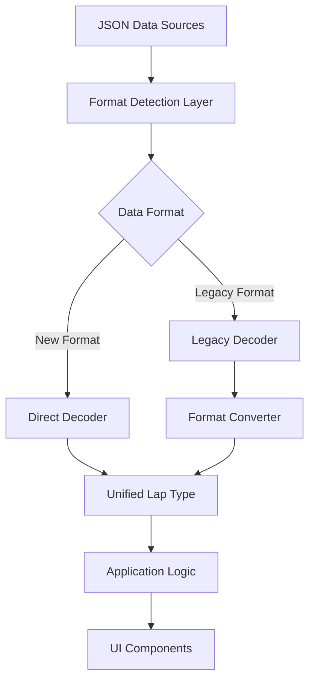
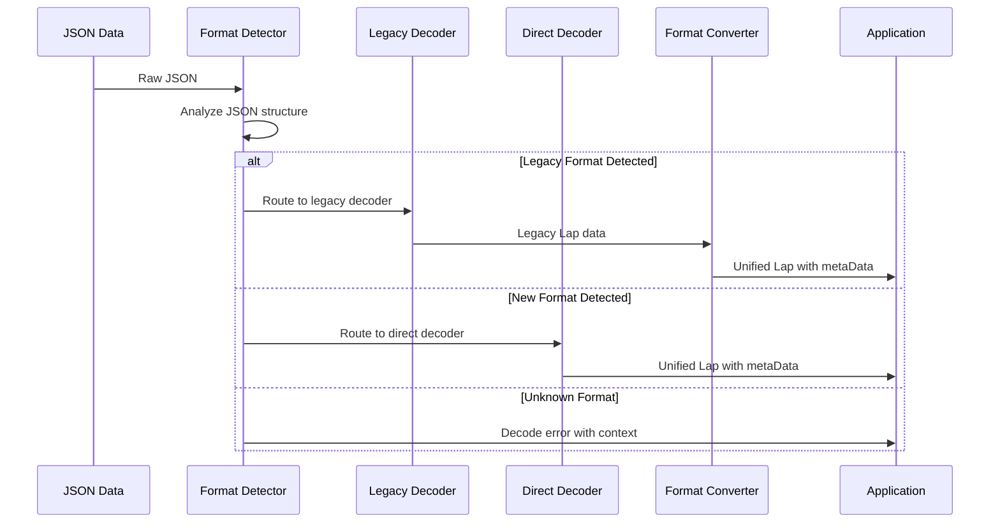
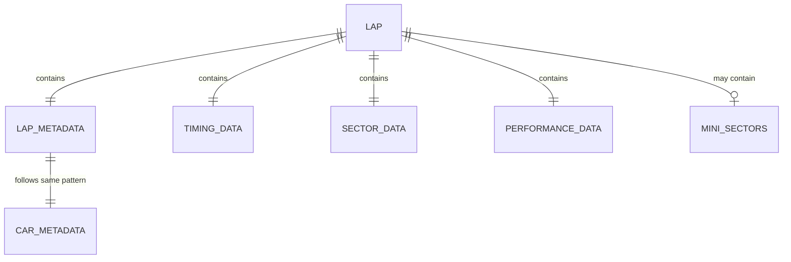
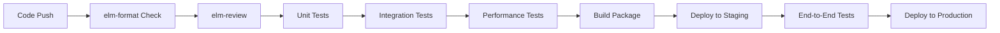

# 技術設計書

## 概要
Lap型データ構造をCar型のmetaDataパターンに整合させ、データ構造の統一性を向上させる技術設計。既存JSONデータとの互換性をElmデコーダーで維持しつつ、将来のCLI出力形式統一に向けた拡張可能な基盤を構築する。

## 要件とのマッピング

### 設計コンポーネントのトレーサビリティ
各設計コンポーネントは特定の要件に対応している：
- **新しいLap型定義** → 要件1.1-1.4: metaDataプロパティによるメタデータ集約と型安全性
- **互換性デコーダー** → 要件2.1-2.4: 既存JSONデータとの互換性維持
- **形式自動検出システム** → 要件3.1-3.4: データ形式の自動検出と変換処理
- **統一アクセスパターン** → 要件4.1-4.4: Car型との一貫したデータアクセス
- **将来拡張基盤** → 要件5.1-5.4: CLI統合への対応と拡張性
- **パフォーマンス最適化** → 要件6.1-6.4: 既存性能の維持とエラーハンドリング

### ユーザーストーリーの対応
- **開発者の一貫性要求**: 新しいLap型とmetaDataアクセスパターンで対応
- **データアナリストの互換性要求**: バックワード互換デコーダーで対応
- **開発者の影響最小化要求**: デコーダーレベルでの差異吸収で対応
- **アーキテクトの将来対応要求**: 拡張可能な設計パターンで対応
- **エンドユーザーのパフォーマンス要求**: 最適化されたデコード処理で対応

## アーキテクチャ

### システム全体図


### 技術スタック
既存のElmモータースポーツ分析プラットフォームのアーキテクチャに基づく：

- **Frontend**: Elm 0.19.1 + elm-pages 3.0.22
- **Data Processing**: 既存のRust CLI (変更なし)
- **JSON Decoding**: Json.Decode + Json.Decode.Pipeline
- **Type System**: Elm的型安全性とMotorsport.Duration
- **Testing**: elm-test フレームワーク

### アーキテクチャ決定の根拠
研究結果と要件分析に基づく技術選択：

- **Elmデコーダーパターン使用理由**: 明示的デコーダーはデバッグが容易で、カスタマイズ可能性が高い
- **oneOfパターン採用理由**: 複数バージョンのサポートに最適で、段階的移行が可能
- **metaDataパターン統一理由**: Car型との一貫性により、コードベース全体での保守性が向上
- **段階的移行採用理由**: 既存システムへの影響を最小限に抑えながら、確実な移行が可能

## データフロー

### 主要ユーザーフロー
JSONデコードから型安全なLap型生成までの流れ：



## コンポーネントとインターフェース

### 新しいLap型定義
```elm
-- 新しい統一されたLap型
type alias Lap =
    { metaData : LapMetaData
    , lap : Int
    , position : Maybe Int
    , timing : TimingData
    , sectors : SectorData
    , performance : PerformanceData
    , miniSectors : Maybe MiniSectors
    }

type alias LapMetaData =
    { carNumber : String
    , driver : String  -- 将来的にはList Driverに拡張可能
    }

type alias TimingData =
    { time : Duration
    , best : Duration
    , elapsed : Duration
    }

type alias SectorData =
    { sector_1 : Duration
    , sector_2 : Duration  
    , sector_3 : Duration
    , s1_best : Duration
    , s2_best : Duration
    , s3_best : Duration
    }

type alias PerformanceData =
    { -- 将来の拡張用（現在は空）
    }
```

### デコーダーコンポーネント

#### メインデコーダー
```elm
module Motorsport.Lap.Decoder exposing (lapDecoder)

import Json.Decode as Decode
import Json.Decode.Pipeline as Pipeline

-- 統一デコーダー（形式自動検出付き）
lapDecoder : Decoder Lap
lapDecoder =
    Decode.oneOf
        [ newFormatDecoder
        , legacyFormatDecoder
        ]

-- 新形式用の直接デコーダー
newFormatDecoder : Decoder Lap
newFormatDecoder =
    Decode.succeed Lap
        |> Pipeline.required "metaData" metaDataDecoder
        |> Pipeline.required "lap" Decode.int
        |> Pipeline.optional "position" (Decode.maybe Decode.int) Nothing
        |> Pipeline.required "timing" timingDataDecoder
        |> Pipeline.required "sectors" sectorDataDecoder
        |> Pipeline.required "performance" performanceDataDecoder
        |> Pipeline.optional "miniSectors" (Decode.maybe miniSectorsDecoder) Nothing

-- レガシー形式用の変換デコーダー
legacyFormatDecoder : Decoder Lap
legacyFormatDecoder =
    Decode.succeed buildLapFromLegacy
        |> Pipeline.required "carNumber" Decode.string
        |> Pipeline.required "driver" Decode.string
        |> Pipeline.required "lap" Decode.int
        |> Pipeline.optional "position" (Decode.maybe Decode.int) Nothing
        |> Pipeline.required "time" Duration.decoder
        |> Pipeline.required "best" Duration.decoder
        |> Pipeline.required "sector_1" Duration.decoder
        |> Pipeline.required "sector_2" Duration.decoder
        |> Pipeline.required "sector_3" Duration.decoder
        |> Pipeline.required "s1_best" Duration.decoder
        |> Pipeline.required "s2_best" Duration.decoder
        |> Pipeline.required "s3_best" Duration.decoder
        |> Pipeline.required "elapsed" Duration.decoder
        |> Pipeline.optional "miniSectors" (Decode.maybe miniSectorsDecoder) Nothing

-- レガシーデータから新形式への変換関数
buildLapFromLegacy : String -> String -> Int -> Maybe Int -> Duration -> Duration -> Duration -> Duration -> Duration -> Duration -> Duration -> Duration -> Duration -> Maybe MiniSectors -> Lap
buildLapFromLegacy carNumber driver lap position time best sector_1 sector_2 sector_3 s1_best s2_best s3_best elapsed miniSectors =
    { metaData = 
        { carNumber = carNumber
        , driver = driver
        }
    , lap = lap
    , position = position
    , timing =
        { time = time
        , best = best
        , elapsed = elapsed
        }
    , sectors =
        { sector_1 = sector_1
        , sector_2 = sector_2
        , sector_3 = sector_3
        , s1_best = s1_best
        , s2_best = s2_best
        , s3_best = s3_best
        }
    , performance = {}
    , miniSectors = miniSectors
    }
```

### API インターフェース

既存のElm関数インターフェースとの互換性を維持：

| 関数名 | 変更前アクセス | 変更後アクセス | 互換性 |
|--------|----------------|----------------|--------|
| carNumber取得 | `lap.carNumber` | `lap.metaData.carNumber` | アクセサー関数で対応 |
| driver取得 | `lap.driver` | `lap.metaData.driver` | アクセサー関数で対応 |
| lap番号取得 | `lap.lap` | `lap.lap` | 変更なし |
| elapsed取得 | `lap.elapsed` | `lap.timing.elapsed` | アクセサー関数で対応 |

### 互換性アクセサー関数
```elm
-- 既存コードとの互換性を保つアクセサー関数
getCarNumber : Lap -> String
getCarNumber lap = lap.metaData.carNumber

getDriver : Lap -> String  
getDriver lap = lap.metaData.driver

getElapsed : Lap -> Duration
getElapsed lap = lap.timing.elapsed

getSector1 : Lap -> Duration
getSector1 lap = lap.sectors.sector_1
```

## データモデル

### ドメインエンティティ
1. **Lap**: 統一されたラップデータ構造
2. **LapMetaData**: Car型MetaDataに整合したメタデータ
3. **TimingData**: タイミング関連データの集約
4. **SectorData**: セクター情報の集約
5. **PerformanceData**: 将来拡張用のパフォーマンスデータ

### エンティティ関係図


### データモデル定義

#### TypeScript互換型定義（参考）
```typescript
interface LapMetaData {
  carNumber: string;
  driver: string;
}

interface TimingData {
  time: number;    // Duration as milliseconds
  best: number;
  elapsed: number;
}

interface SectorData {
  sector_1: number;
  sector_2: number;
  sector_3: number;
  s1_best: number;
  s2_best: number;
  s3_best: number;
}

interface UnifiedLap {
  metaData: LapMetaData;
  lap: number;
  position?: number;
  timing: TimingData;
  sectors: SectorData;
  performance: Record<string, unknown>;
  miniSectors?: MiniSectors;
}
```

### JSONスキーマ

#### 新形式JSONスキーマ
```json
{
  "type": "object",
  "required": ["metaData", "lap", "timing", "sectors", "performance"],
  "properties": {
    "metaData": {
      "type": "object",
      "required": ["carNumber", "driver"],
      "properties": {
        "carNumber": {"type": "string"},
        "driver": {"type": "string"}
      }
    },
    "lap": {"type": "integer"},
    "position": {"type": ["integer", "null"]},
    "timing": {
      "type": "object",
      "required": ["time", "best", "elapsed"],
      "properties": {
        "time": {"type": "number"},
        "best": {"type": "number"},
        "elapsed": {"type": "number"}
      }
    },
    "sectors": {
      "type": "object",
      "required": ["sector_1", "sector_2", "sector_3", "s1_best", "s2_best", "s3_best"],
      "properties": {
        "sector_1": {"type": "number"},
        "sector_2": {"type": "number"},
        "sector_3": {"type": "number"},
        "s1_best": {"type": "number"},
        "s2_best": {"type": "number"},
        "s3_best": {"type": "number"}
      }
    },
    "performance": {"type": "object"},
    "miniSectors": {"type": ["object", "null"]}
  }
}
```

### 移行戦略
段階的なデータ移行アプローチ：

- **フェーズ1**: 互換デコーダーの実装と既存システムでの動作確認
- **フェーズ2**: 新しいLap型の段階的導入とアクセサー関数による互換性維持
- **フェーズ3**: CLI出力形式の統一と新形式での完全移行
- **フェーズ4**: レガシーデコーダーの廃止とクリーンアップ

## エラーハンドリング

### デコードエラー処理戦略
```elm
type LapDecodeError
    = UnknownFormat String
    | MissingRequiredField String
    | InvalidFieldValue String String
    | LegacyFormatConversionError String

decodeLapWithErrorHandling : String -> Result LapDecodeError Lap
decodeLapWithErrorHandling jsonString =
    case Decode.decodeString lapDecoder jsonString of
        Ok lap ->
            Ok lap
        
        Err decodeError ->
            Err (mapDecodeError decodeError)

mapDecodeError : Decode.Error -> LapDecodeError
mapDecodeError error =
    case error of
        Decode.Failure message _ ->
            if String.contains "metaData" message then
                MissingRequiredField "metaData"
            else if String.contains "carNumber" message then
                MissingRequiredField "carNumber"
            else
                UnknownFormat message
        
        _ ->
            UnknownFormat (Decode.errorToString error)
```

### ログ出力とデバッグ
```elm
-- デバッグ用のログ出力関数
logDecodeAttempt : String -> String -> Lap -> Lap
logDecodeAttempt format jsonSample lap =
    let
        _ = Debug.log ("Successfully decoded " ++ format ++ " format") 
              (String.left 100 jsonSample)
    in
    lap

-- デコーダーにログ機能を統合
lapDecoderWithLogging : Decoder Lap
lapDecoderWithLogging =
    Decode.oneOf
        [ Decode.map (logDecodeAttempt "new") newFormatDecoder
        , Decode.map (logDecodeAttempt "legacy") legacyFormatDecoder
        ]
```

## セキュリティ考慮事項

### データ検証
Elmの型システムによる基本的な型安全性に加えて：

- **入力値検証**: carNumberの形式チェック
- **範囲検証**: lap番号の正の整数チェック
- **Duration値検証**: 負の値やNaN値の排除

```elm
validateLap : Lap -> Result String Lap
validateLap lap =
    if lap.lap <= 0 then
        Err "Lap number must be positive"
    else if String.isEmpty lap.metaData.carNumber then
        Err "Car number cannot be empty"
    else if lap.timing.time < 0 then
        Err "Lap time cannot be negative"
    else
        Ok lap
```

### 不正データ対策
- **JSONスキーマ検証**: 予期しない構造のJSONデータを早期検出
- **フォールバック処理**: デコードエラー時の安全な回復処理
- **サニタイゼーション**: 文字列データの基本的なクリーニング

## パフォーマンスとスケーラビリティ

### パフォーマンス目標
| メトリック | 目標値 | 測定方法 |
|------------|--------|----------|
| デコード時間(p95) | < 1ms/lap | 1000ラップのバッチ処理 |
| デコード時間(p99) | < 2ms/lap | 大規模レースデータ処理 |
| メモリ使用量 | 既存比+5%以内 | Elm Debuggerによる測定 |
| JSONファイルサイズ | 変更なし | 既存データとの互換性 |

### キャッシュ戦略
Elmの不変データ構造を活用：

- **Lap型インスタンス**: 不変性により自動的にキャッシュ効果
- **デコード結果**: 同一JSONデータに対するデコード結果の再利用
- **メタデータアクセス**: アクセサー関数の結果キャッシュ

### スケーラビリティアプローチ
- **並列デコード**: 大量のラップデータの並列処理サポート
- **段階的ロード**: 必要に応じたデータの遅延読み込み
- **メモリ効率**: 不要なデータ変換の最小化

## テスト戦略

### テストカバレッジ要件
- **ユニットテスト**: ≥90% デコーダーとアクセサー関数
- **統合テスト**: 全JSONデータ形式のデコード確認
- **パフォーマンステスト**: 大規模データセットでの性能測定

### テストアプローチ

#### ユニットテスト
```elm
module Tests.Motorsport.Lap.DecoderTest exposing (suite)

import Test exposing (..)
import Expect
import Json.Decode as Decode
import Motorsport.Lap.Decoder exposing (lapDecoder)

suite : Test
suite =
    describe "Lap Decoder Tests"
        [ test "decodes new format successfully" <|
            \_ ->
                let
                    json = """
                    {
                        "metaData": {"carNumber": "1", "driver": "Driver A"},
                        "lap": 1,
                        "timing": {"time": 90000, "best": 89000, "elapsed": 90000},
                        "sectors": {"sector_1": 30000, "sector_2": 30000, "sector_3": 30000, "s1_best": 29000, "s2_best": 29000, "s3_best": 29000},
                        "performance": {}
                    }
                    """
                in
                case Decode.decodeString lapDecoder json of
                    Ok lap ->
                        Expect.equal "1" lap.metaData.carNumber
                    
                    Err _ ->
                        Expect.fail "Should decode successfully"
        
        , test "decodes legacy format successfully" <|
            \_ ->
                let
                    json = """
                    {
                        "carNumber": "2",
                        "driver": "Driver B", 
                        "lap": 2,
                        "time": 91000,
                        "best": 90000,
                        "sector_1": 31000,
                        "sector_2": 30000,
                        "sector_3": 30000,
                        "s1_best": 30000,
                        "s2_best": 29000,
                        "s3_best": 29000,
                        "elapsed": 181000
                    }
                    """
                in
                case Decode.decodeString lapDecoder json of
                    Ok lap ->
                        Expect.all
                            [ \l -> Expect.equal "2" l.metaData.carNumber
                            , \l -> Expect.equal "Driver B" l.metaData.driver
                            , \l -> Expect.equal 2 l.lap
                            ]
                            lap
                    
                    Err error ->
                        Expect.fail ("Should decode successfully: " ++ Decode.errorToString error)
        ]
```

#### 統合テスト
```elm
module Tests.Motorsport.Lap.IntegrationTest exposing (suite)

suite : Test  
suite =
    describe "Lap Integration Tests"
        [ test "maintains compatibility with existing F1 data" <|
            \_ ->
                -- 既存のF1データファイルでのテスト
                loadF1TestData()
                    |> decodeAllLaps
                    |> Expect.all
                        [ List.length >> Expect.greaterThan 0
                        , List.all (.metaData >> .carNumber >> String.isEmpty >> not) >> Expect.true "All laps should have car numbers"
                        ]
        
        , test "maintains compatibility with existing WEC data" <|
            \_ ->
                -- 既存のWECデータファイルでのテスト
                loadWecTestData()
                    |> decodeAllLaps  
                    |> Expect.all
                        [ List.length >> Expect.greaterThan 0
                        , List.all (.timing >> .elapsed >> \e -> e > 0) >> Expect.true "All laps should have positive elapsed time"
                        ]
        ]
```

#### パフォーマンステスト
```elm
module Tests.Motorsport.Lap.PerformanceTest exposing (suite)

suite : Test
suite = 
    describe "Lap Performance Tests"
        [ test "decodes 1000 laps within time limit" <|
            \_ ->
                let
                    largeLapData = generateLargeLapDataset 1000
                    startTime = now()
                in
                case decodeLapBatch largeLapData of
                    Ok laps ->
                        let
                            endTime = now()
                            duration = endTime - startTime
                        in
                        Expect.lessThan 1000 duration -- 1秒以内
                    
                    Err _ ->
                        Expect.fail "Should decode large dataset successfully"
        ]
```

### CI/CDパイプライン


## 実装計画

### マイルストーン

#### マイルストーン1: 基盤実装 (1週間)
- [ ] 新しいLap型の定義
- [ ] 基本デコーダーの実装
- [ ] ユニットテストの作成

#### マイルストーン2: 互換性実装 (1週間)  
- [ ] レガシーデコーダーの実装
- [ ] 形式自動検出の実装
- [ ] 統合テストの作成

#### マイルストーン3: 最適化と統合 (1週間)
- [ ] アクセサー関数の実装
- [ ] パフォーマンス最適化
- [ ] 既存コードとの統合テスト

#### マイルストーン4: 検証とドキュメント (1週間)
- [ ] 大規模データでの検証
- [ ] ドキュメントの更新
- [ ] 移行ガイドの作成

### リスクと緩和策

| リスク | 影響度 | 緩和策 |
|--------|--------|--------|
| 既存データの互換性問題 | 高 | 段階的移行とフォールバック機能 |
| パフォーマンス劣化 | 中 | ベンチマークと最適化 |
| 未知のJSONスキーマ | 中 | 包括的テストとエラーハンドリング |
| 開発工数の増加 | 低 | 明確なマイルストーンと並行作業 |